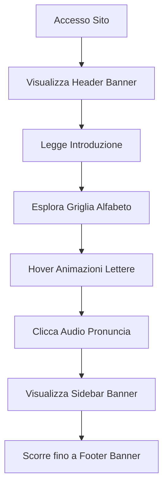

## 1. Panoramica Prodotto
Sito web monopagina educativo dedicato alla presentazione dell'alfabeto arabo con 28 lettere, trascrizione fonetica e pronuncia. Il prodotto si rivolge a studenti, insegnanti e appassionati di lingua araba che desiderano apprendere o insegnare le basi dell'alfabeto arabo in modo interattivo e visivamente accattivante.

## 2. Funzionalità Principali

### 2.2 Modulo Funzionalità
Il sito web monopagina dell'alfabeto arabo consiste nel seguente contenuto principale:
1. **Pagina Principale**: presentazione completa delle 28 lettere arabe con trascrizione fonetica, pronuncia audio, banner pubblicitari Google AdSense, design responsive con animazioni CSS.

### 2.3 Dettagli Pagina
| Nome Pagina | Modulo | Descrizione Funzionalità |
|-------------|---------|-------------------------|
| Pagina Principale | Header Banner 728x90 | Visualizza annuncio Google AdSense formato leaderboard in posizione superiore |
| Pagina Principale | Sezione Introduzione | Presenta titolo in arabo e italiano, descrizione breve del sito |
| Pagina Principale | Griglia Alfabeto | Mostra tutte e 28 le lettere arabe in formato grid responsive |
| Pagina Principale | Card Lettera Araba | Visualizza lettera araba, nome italiano, trascrizione fonetica IPA, pulsante audio pronuncia |
| Pagina Principale | Animazioni Hover | Effetti CSS fluidi al passaggio mouse per migliorare interazione |
| Pagina Principale | Sidebar Banner 300x250 | Annuncio Google AdSense formato medio rettangolo in sidebar laterale |
| Pagina Principale | Footer Banner 970x90 | Annuncio Google AdSense formato large leaderboard in fondo pagina |
| Pagina Principale | SEO Meta Tags | Meta tag specifici per contenuti arabi, schema.org structured data |
| Pagina Principale | Accessibilità | Supporto screen reader, contrasto WCAG AAA, ARIA labels |

## 3. Flusso Principale
L'utente accede al sito e visualizza immediatamente l'alfabeto arabo completo. Può scorrere le lettere, passare il mouse per vedere animazioni, cliccare per ascoltare la pronuncia. Gli annunci AdSense sono visibili in tre posizioni strategiche senza interferire con l'esperienza educativa.

## 4. Design Interfaccia Utente

### 4.1 Stile Design
- Colori primari: Blu intenso (#1e3a8a), Oro (#fbbf24), Bianco (#ffffff)
- Colori secondari: Blu scuro (#1e40af), Oro scuro (#f59e0b)
- Stile bottoni: Rounded corners, ombreggiatura 3D sottile
- Font: "Noto Kufi Arabic" per testo arabo, "Scheherazade" per heading, sans-serif per italiano
- Dimensioni font: Titoli 2.5rem, testo arabo 3rem, trascrizione 1.2rem
- Layout: Card-based grid system, top navigation minimal
- Icone: Stile arabo tradizionale con pattern geometrici

### 4.2 Panoramica Design Pagina
| Nome Pagina | Modulo | Elementi UI |
|-------------|---------|-------------|
| Pagina Principale | Header | Banner AdSense 728x90 centrato, logo sito in arabo e italiano |
| Pagina Principale | Hero Section | Background sfumato blu-oro, titolo calligrafico arabo, sottotitolo italiano |
| Pagina Principale | Griglia Lettere | 4 colonne desktop / 2 colonne tablet / 1 colonna mobile, gap 1.5rem |
| Pagina Principale | Card Lettera | Background bianco con bordo oro, hover effect scala 1.05, transizione 0.3s |
| Pagina Principale | Audio Player | Pulsante play dorato, icona altoparlante, onda sonora animata |

### 4.3 Responsiveness
Mobile-first approach con breakpoint: 320px (mobile), 768px (tablet), 1024px (desktop), 1440px (large desktop). Touch optimization per dispositivi mobili con area clic minima 44x44px.

### 4.4 Performance
Lazy loading implementato per eventuali immagini decorative, font loading ottimizzato con font-display: swap, CSS e JS minificati, caricamento critico inline, target tempo di caricamento < 2.5 secondi su 3G.