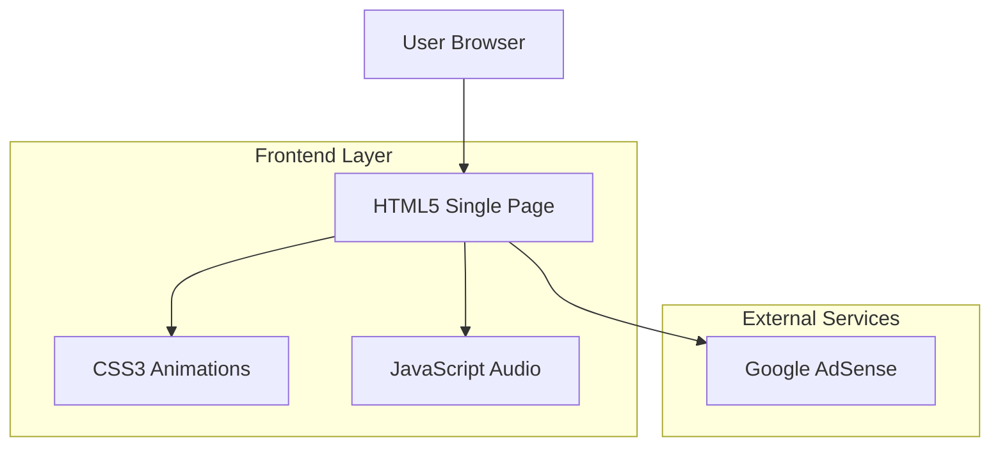

## 1. Architettura Design



## 2. Descrizione Tecnologia

- Frontend: HTML5 + CSS3 + JavaScript ES6
- Build Tool: None (static site)
- Backend: None (client-side only)
- Hosting: Static hosting (Netlify/Vercel/GitHub Pages)

## 3. Definizioni Route

| Route | Scopo |
|-------|--------|
| / | Pagina principale con alfabeto arabo completo |

## 4. Performance Optimization

### 4.1 Critical Rendering Path
- Inline critical CSS
- Async font loading with font-display: swap
- Preload key resources
- Minimize render-blocking resources

### 4.2 Asset Optimization
- CSS minification
- JavaScript bundling and minification
- Image optimization (WebP format when possible)
- Gzip compression enabled

## 5. SEO & Meta Tags

### 5.1 Essential Meta Tags
```html
<meta charset="UTF-8">
<meta name="viewport" content="width=device-width, initial-scale=1.0">
<meta name="description" content="Impara l'alfabeto arabo con pronuncia e trascrizione fonetica">
<meta name="keywords" content="alfabeto arabo, arabo, lingua araba, pronuncia araba">
<meta name="author" content="Arabic Alphabet Learning">
<meta property="og:title" content="Alfabeto Arabo - Impara le 28 lettere">
<meta property="og:description" content="Scopri tutte le lettere dell'alfabeto arabo con pronuncia audio">
<meta property="og:type" content="website">
<meta property="og:locale" content="ar_AR">
<meta property="og:locale:alternate" content="it_IT">
```

### 5.2 Structured Data
```json
{
  "@context": "https://schema.org",
  "@type": "EducationalWebsite",
  "name": "Alfabeto Arabo",
  "description": "Risorsa educativa per l'apprendimento dell'alfabeto arabo",
  "inLanguage": ["ar", "it"],
  "learningResourceType": "Alphabet"
}
```

## 6. Accessibility Implementation

### 6.1 WCAG AAA Compliance
- Color contrast ratio ≥ 7:1 for normal text
- Color contrast ratio ≥ 4.5:1 for large text
- Keyboard navigation support
- Focus indicators visible
- Screen reader announcements for audio playback

### 6.2 ARIA Implementation
```html
<button aria-label="Ascolta pronuncia lettera أ" 
        aria-pressed="false"
        role="button"
        tabindex="0">
```

## 7. Google AdSense Integration

### 7.1 Ad Placement Strategy
- Header: 728x90 (responsive)
- Sidebar: 300x250 (desktop only)
- Footer: 970x90 (responsive)

### 7.2 Policy Compliance
- Educational content suitable for all ages
- No copyrighted material
- Proper ad labeling
- Responsive ad units for mobile optimization

## 8. Audio Implementation

### 8.1 Web Audio API
- Preload audio files
- Fallback to HTML5 audio
- Volume control
- Playback state management

### 8.2 Audio Files Structure
```
/audio/
  ├── alef.mp3
  ├── ba.mp3
  ├── ta.mp3
  └── ... (28 files total)
```

## 9. Font Loading Strategy

### 9.1 Font Stack
```css
font-family: 'Noto Kufi Arabic', 'Scheherazade', serif;
```

### 9.2 Font Loading
```html
<link rel="preconnect" href="https://fonts.googleapis.com">
<link rel="preconnect" href="https://fonts.gstatic.com" crossorigin>
<link href="https://fonts.googleapis.com/css2?family=Noto+Kufi+Arabic:wght@400;700&family=Scheherazade:wght@400;700&display=swap" rel="stylesheet">
```

## 10. CSS Architecture

### 10.1 BEM Methodology
```css
.letter-card {}
.letter-card__arabic {}
.letter-card__transcription {}
.letter-card__audio-btn {}
```

### 10.2 CSS Custom Properties
```css
:root {
  --color-primary: #1e3a8a;
  --color-secondary: #fbbf24;
  --color-accent: #ffffff;
  --spacing-unit: 1rem;
}
```